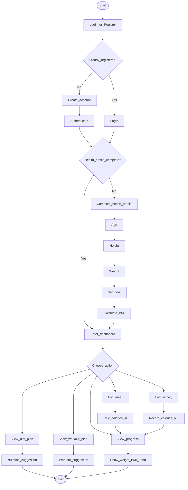

# Activity — Auth & onboarding

Migrated from session 2. Covers register/login, health profile completion, BMI, then dashboard choices.

```mermaid
flowchart TD
  A([Start]) --> B[Login_or_Register]
  B --> C{Already_registered?}
  C -->|No| D[Create_account]
  D --> E[Authenticate]
  C -->|Yes| F[Login]
  E --> G{Health_profile_complete?}
  F --> G
  G -->|No| H[Complete_health_profile]
  H --> H1[Age]
  H1 --> H2[Height]
  H2 --> H3[Weight]
  H3 --> H4[Set_goal]
  H4 --> I[Calculate_BMI]
  G -->|Yes| J[Enter_dashboard]
  I --> J
  J --> K{Choose_action}
  K --> L[Log_meal]
  K --> M[Log_activity]
  K --> N[View_progress]
  K --> O[View_diet_plan]
  K --> P[View_workout_plan]
  L --> Q[Calc_calories_in]
  M --> R[Record_calories_out]
  Q --> N
  R --> N
  O --> S[Nutrition_suggestion]
  P --> T[Workout_suggestion]
  N --> U[Show_weight_BMI_trend]
  S --> V([End])
  T --> V
  U --> V
```
