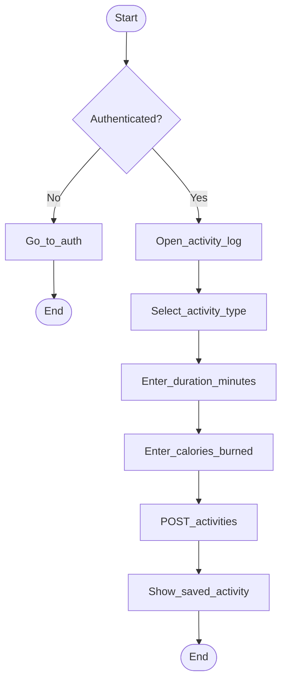

# Activity 4 — Log activity

```mermaid
flowchart TD
  startNode([Start]) --> auth{Authenticated?}
  auth -->|No| login[Go_to_auth]
  login --> endFail([End])
  auth -->|Yes| open[Open_activity_log]
  open --> kind[Select_activity_type]
  kind --> dur[Enter_duration_minutes]
  dur --> burn[Enter_calories_burned]
  burn --> save[POST_activities]
  save --> confirm[Show_saved_activity]
  confirm --> endOk([End])
```

## Notes

- Semester scope: **manual** entry (no wearables).
- Activity types (MVP): `walk`, `run`, `gym`, `sport`, `other`.
