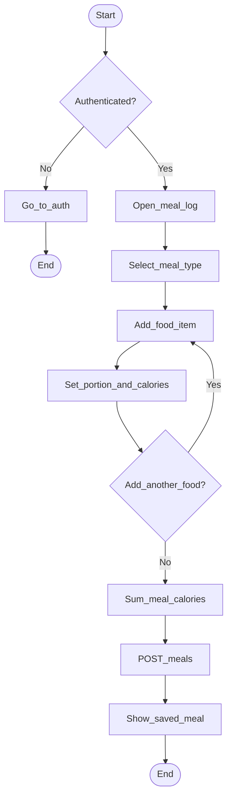

# Activity 3 — Log meal

```mermaid
flowchart TD
  startNode([Start]) --> auth{Authenticated?}
  auth -->|No| login[Go_to_auth]
  login --> endFail([End])
  auth -->|Yes| open[Open_meal_log]
  open --> type[Select_meal_type]
  type --> add[Add_food_item]
  add --> portion[Set_portion_and_calories]
  portion --> more{Add_another_food?}
  more -->|Yes| add
  more -->|No| total[Sum_meal_calories]
  total --> save[POST_meals]
  save --> confirm[Show_saved_meal]
  confirm --> endOk([End])
```

## Meal types (MVP)

`breakfast` · `lunch` · `dinner` · `snack`
