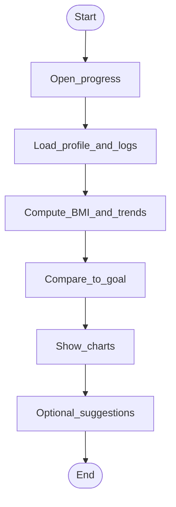

# Activity — Progress report

**Status:** stub — refine after TFIT research.

```mermaid
flowchart TD
  A([Start]) --> B[Open_progress]
  B --> C[Load_profile_and_logs]
  C --> D[Compute_BMI_and_trends]
  D --> E[Compare_to_goal]
  E --> F[Show_charts]
  F --> G[Optional_suggestions]
  G --> H([End])
```
