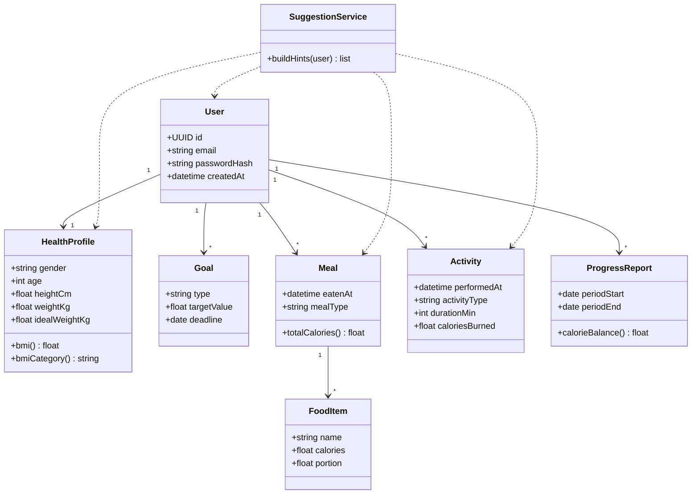

# Class 1 — Domain overview

Full Relapsa domain. Detail packages in the other class docs.

```mermaid
classDiagram
  direction TB

  class User {
    +UUID id
    +string email
    +string passwordHash
    +datetime createdAt
  }

  class HealthProfile {
    +string gender
    +int age
    +float heightCm
    +float weightKg
    +float idealWeightKg
    +bmi() float
    +bmiCategory() string
  }

  class Goal {
    +string type
    +float targetValue
    +date deadline
  }

  class Meal {
    +datetime eatenAt
    +string mealType
    +totalCalories() float
  }

  class FoodItem {
    +string name
    +float calories
    +float portion
  }

  class Activity {
    +datetime performedAt
    +string activityType
    +int durationMin
    +float caloriesBurned
  }

  class ProgressReport {
    +date periodStart
    +date periodEnd
    +calorieBalance() float
  }

  class SuggestionService {
    +buildHints(user) list
  }

  User "1" --> "1" HealthProfile
  User "1" --> "*" Goal
  User "1" --> "*" Meal
  User "1" --> "*" Activity
  Meal "1" --> "*" FoodItem
  User "1" --> "*" ProgressReport
  SuggestionService ..> User
  SuggestionService ..> HealthProfile
  SuggestionService ..> Meal
  SuggestionService ..> Activity
```
