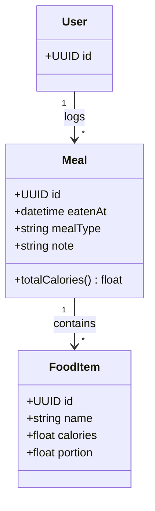

# Class 4 — Nutrition

Maps to Django app `nutrition`. Relapsa differentiator vs TFIT.

```mermaid
classDiagram
  direction TB

  class User {
    +UUID id
  }

  class Meal {
    +UUID id
    +datetime eatenAt
    +string mealType
    +string note
    +totalCalories() float
  }

  class FoodItem {
    +UUID id
    +string name
    +float calories
    +float portion
  }

  User "1" --> "*" Meal : logs
  Meal "1" --> "*" FoodItem : contains
```

## mealType values

`breakfast` · `lunch` · `dinner` · `snack`
