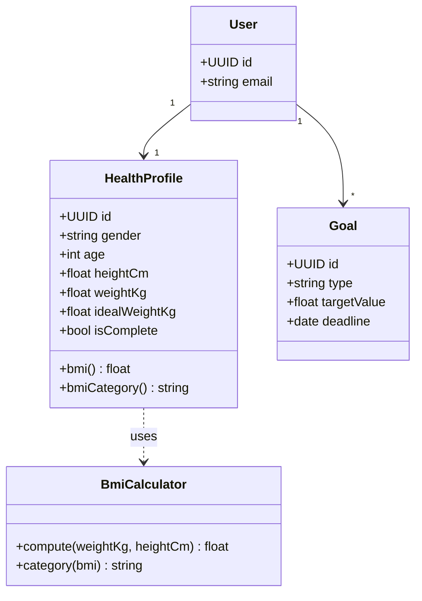

# Class 3 — Health profile & goals

Maps to Django app `profiles`.

```mermaid
classDiagram
  direction TB

  class User {
    +UUID id
    +string email
  }

  class HealthProfile {
    +UUID id
    +string gender
    +int age
    +float heightCm
    +float weightKg
    +float idealWeightKg
    +bool isComplete
    +bmi() float
    +bmiCategory() string
  }

  class Goal {
    +UUID id
    +string type
    +float targetValue
    +date deadline
  }

  class BmiCalculator {
    +compute(weightKg, heightCm) float
    +category(bmi) string
  }

  User "1" --> "1" HealthProfile
  User "1" --> "*" Goal
  HealthProfile ..> BmiCalculator : uses
```

## Goal types (MVP)

`lose_weight` · `gain_weight` · `maintain` · `build_muscle`
