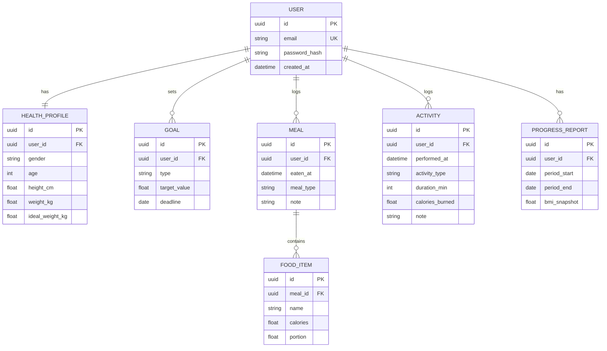

# Database (PostgreSQL)

```mermaid
erDiagram
  USER ||--|| HEALTH_PROFILE : has
  USER ||--o{ GOAL : sets
  USER ||--o{ MEAL : logs
  USER ||--o{ ACTIVITY : logs
  USER ||--o{ PROGRESS_REPORT : has
  MEAL ||--o{ FOOD_ITEM : contains

  USER {
    uuid id PK
    string email UK
    string password_hash
    datetime created_at
  }

  HEALTH_PROFILE {
    uuid id PK
    uuid user_id FK
    string gender
    int age
    float height_cm
    float weight_kg
    float ideal_weight_kg
  }

  GOAL {
    uuid id PK
    uuid user_id FK
    string type
    float target_value
    date deadline
  }

  MEAL {
    uuid id PK
    uuid user_id FK
    datetime eaten_at
    string meal_type
    string note
  }

  FOOD_ITEM {
    uuid id PK
    uuid meal_id FK
    string name
    float calories
    float portion
  }

  ACTIVITY {
    uuid id PK
    uuid user_id FK
    datetime performed_at
    string activity_type
    int duration_min
    float calories_burned
    string note
  }

  PROGRESS_REPORT {
    uuid id PK
    uuid user_id FK
    date period_start
    date period_end
    float bmi_snapshot
  }
```

BMI is computed from profile (not a required stored column). JWT tokens are not tables (SimpleJWT).
